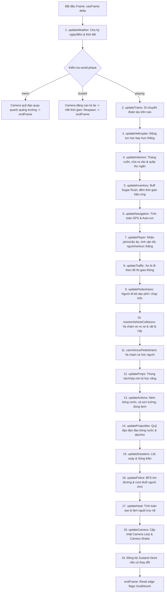

# Kiến trúc Kỹ thuật (Technical Architecture)

Tài liệu này mô tả chi tiết toàn bộ kiến trúc nền tảng của **Splash City**, từ triết lý thiết kế, mô hình quản lý trạng thái, vòng lặp mô phỏng vật lý, cho tới hệ thống không gian ảo và 3 hợp đồng tích hợp hệ thống cốt lõi.

---

## 1. Triết lý Thiết kế Cốt lõi (Core Architectural Philosophy)

### Nguyên tắc Vàng: *React KHÔNG BAO GIỜ sở hữu Trạng thái Mô phỏng*
```
[React Tree / UI Overlays / HUD]
           │
           │ (Đọc snapshot có chọn lọc qua Zustand Store @ ~5Hz)
           ▼
[Zustand Store (store.js)] <── [GameLoop sync / throttling]
                                     ▲
                                     │ (Mutation trực tiếp in-place @ 60 FPS)
                             [World State (world.js)]
                                     ▲
                                     │ (Cập nhật tuần tự 17+ hệ thống)
                             [Game Systems Pipeline]
```

1. **Hiệu năng 60 FPS với số lượng thực thể lớn**:
   - Nếu đưa vị trí của 80+ thực thể (xe cộ, người đi bộ, cảnh sát, tàu điện, trực thăng, bóng nước, kệ hàng) vào `useState` hoặc React State truyền thống, toàn bộ React component tree sẽ re-render 60 lần/giây, gây sập hiệu năng (thường giảm xuống < 15 FPS chỉ với ~30 thực thể).
   - Trong Splash City, **toàn bộ trạng thái thế giới là một plain JavaScript object có thể đột biến trực tiếp** (`src/game/world.js`).
2. **Tách biệt Triệt để giữa Mô phỏng (Simulation) và Hiển thị (Rendering)**:
   - Các hệ thống (`src/game/systems/*`) chỉ thao tác logic trên đối tượng `world`.
   - Các component đồ họa (`src/render/*`) chỉ đọc từ `world` để cập nhật ma trận biến đổi của `InstancedMesh` hoặc shader uniforms trong frame hiện tại.
   - UI 2D (HUD, Minimap, Phone Overlay, Map Overlay, Disaster Banner) chỉ lắng nghe các giá trị tóm tắt (điểm, sao nhiệt, đạn, trạng thái mở menu) thông qua Zustand store được đồng bộ có chọn lọc khi có thay đổi thực sự.
3. **Zero External Assets (100% Procedural)**:
   - Không chứa bất kỳ file nhị phân 3D (`.glb`, `.fbx`), texture hình ảnh lớn (`.png`, `.jpg`), hay file audio (`.mp3`, `.wav`).
   - Mọi hình học 3D được sinh bằng thuật toán procedural geometry & Canvas 2D dynamic textures.
   - Mọi âm thanh (tiếng động cơ, trực thăng, còi hú, sấm sét, tiếng tạt nước, thang cuốn, quét mã SplashPay) được tổng hợp thời gian thực bằng Web Audio API oscillators & noise filters.

---

## 2. Mô hình Dữ liệu Thế giới (`world.js`)

Đối tượng `world` được khởi tạo bởi `createWorld()` trong `src/game/world.js` và tồn tại xuyên suốt vòng đời của game:

```typescript
interface World {
  city: CityData;               // Dữ liệu bản đồ, khối nhà, mạng lưới đường
  bp: BroadphaseGrid;           // Lưới không gian va chạm Broadphase
  time: number;                 // Tổng thời gian game đã trôi qua (giây)
  timeOfDay: number;            // Giờ trong ngày (0..24, mặc định bắt đầu lúc 9.5)
  weather: WeatherDirector;     // Bộ quản lý thời tiết và tham số pha trộn
  disaster: DisasterState;      // Trạng thái thiên tai (Tornado, Tsunami)
  phase: 'menu' | 'playing' | 'busted';

  player: PlayerState;          // Tọa độ (x, y, z), vận tốc, góc xoay, trạng thái di chuyển ('foot' | 'car' | 'train' | 'heli')
  camera: CameraState;          // Góc xoay yaw, pitch, tọa độ và độ rung lắc (shake)
  
  // Phương tiện & Thực thể Đô thị
  cars: CarEntity[];            // Danh sách xe lưu thông và xe đỗ
  peds: PedestrianEntity[];     // Danh sách người đi bộ
  props: PropEntity[];          // Đồ đạc trên phố (thùng rác, cọc tiêu, vòi nước)
  trains: TrainEntity[];        // Đoàn tàu điện trên cao
  helicopter: HeliEntity;       // Trực thăng ngắm cảnh & cơ chế bay 3D
  fountains: Point2D[];         // Điểm phun nước để nạp đạn bóng nước

  // Hệ thống Nội thất & Túi đồ
  interior: 'none' | 'police_station' | 'supermarket';
  inventory: InventoryItem[];   // Danh sách vật phẩm đã mua (Oreo, Lay's, Chuối, P/S, v.v.)
  activeBuffs: ActiveBuff[];    // Hiệu ứng Sugar Rush, Speed Boost
  bananas: BananaEntity[];      // Vỏ chuối rải trên sàn/đường
  toothpastePatches: Patch[];   // Vệt trơn kem đánh răng P/S trên sàn

  // Bản đồ & Điều hướng GPS
  navigation: NavState;         // Tự động chạy theo lộ trình GPS đến đích
  phoneOpen: boolean;           // Màn hình Smartphone SplashPay
  mapOpen: boolean;             // Bản đồ thành phố toàn màn hình

  // Lực lượng Cảnh sát & Quậy phá
  police: PoliceCarEntity[];    // Danh sách xe cảnh sát (Object Pool: MAX_POLICE = 8)
  footCops: FootCopEntity[];    // Danh sách cảnh sát đi bộ (Object Pool: MAX_FOOT_COPS = 8)
  balloons: BalloonEntity[];    // Đạn bóng nước đang bay (Object Pool: MAX_BALLOONS = 40)
  splashes: SplashEntity[];     // Hiệu ứng nước bắn tung tóe (Object Pool: MAX_SPLASHES = 28)
  decals: PaintDecal[];         // Vết sơn cầu vồng trên tường

  // Chỉ số Gameplay
  heat: number;                 // Mức độ truy nã (0..100)
  stars: number;                // Số sao cảnh sát (0..4)
  score: number;                // Điểm số quậy phá
  ammo: number;                 // Số lượng bóng nước dự trữ (tối đa 16)
  lang: 'vi' | 'en';            // Ngôn ngữ hiển thị
  stats: GameStats;             // Thống kê thành tích
}
```

### Kỹ thuật Object Pooling
Để tránh Garbage Collection (GC) pauses gây giật khung hình (frame drops) trên trình duyệt, các thực thể có tần suất sinh/hủy cao (cảnh sát, đạn bóng nước, vệt nước, vỏ chuối, vệt kem đánh răng) được khởi tạo sẵn trong các mảng cố định (fixed-size pools) với cờ `active: boolean`.

---

## 3. Vòng lặp Game Tích hợp Đơn nhất (`GameLoop.jsx`)

Game chỉ đăng ký **duy nhất một hook `useFrame`** tại `src/game/GameLoop.jsx`. Hook này điều phối toàn bộ 17 hệ thống theo một thứ tự thực thi xác định nghiêm ngặt:



### Tại sao thứ tự này lại quan trọng?
1. **Tàu điện & Trực thăng chạy trước Người chơi**: Người chơi đứng trên nóc toa tàu hoặc ngồi trong buồng lái trực thăng sẽ được kế thừa tọa độ của phương tiện ngay trong frame đó, loại bỏ hiện tượng trễ 1 frame (frame jitter).
2. **Nội thất & Túi đồ chạy trước Input Player**: Kiểm tra xem người chơi có đang dùng vật phẩm tăng tốc (Sugar Rush) hoặc di chuyển trên thang cuốn hay không trước khi tính toán vận tốc cuối cùng.
3. **Thiên tai chạy sau hệ thống di chuyển thông thường**: Lốc xoáy và sóng thần có quyền ghi đè vị trí cuối cùng của xe cộ và người đi bộ khi chúng bị cuốn lên không trung.

---

## 4. Hệ thống Không gian & Xử lý Va chạm (`collision.js`)

Splash City sử dụng mô hình vật lý arcade phẳng tùy biến 2.5D (Flat 2D Plane với chiều cao Z/Y), không phụ thuộc vào các engine vật lý cồng kềnh như Cannon.js hay Rapier.

### 4.1 Cấu trúc Lưới Broadphase (Uniform Grid Spatial Hash)
- Toàn bộ các khối tĩnh của thành phố (tòa nhà, cột trụ đường ray, bệ ga) được đóng gói thành các Axis-Aligned Bounding Boxes (AABB).
- Không gian được chia thành các ô lưới kích thước `CELL_SIZE = 24` đơn vị.
- Hàm băm: `key = (cx, cz) => cx * 100000 + cz`.
- Khi kiểm tra va chạm của một hình tròn bán kính $R$ tại $(x, z)$, hệ thống chỉ truy vấn các ô lưới xung quanh trong phạm vi $[(x-R)/24, (x+R)/24]$, giảm độ phức tạp từ $O(N)$ xuống $O(1)$.

### 4.2 Giải quyết Va chạm Đa độ cao (`resolveStatic`)
Hàm `resolveStatic(bp, ent, radius, entY)` hỗ trợ tham số độ cao `entY`:
- Các chướng ngại vật có thuộc tính `height`. Nếu `b.height <= entY + 0.1`, đối tượng sẽ đi xuyên qua đỉnh chướng ngại vật mà không bị chặn.
- **Ứng dụng thực tế**: 
  - Người chơi đứng trên bệ ga trên cao ($y = 9$) có thể đi bộ tự do qua không gian phía trên các cột trụ đỡ đường ray.
  - Trực thăng bay ở độ cao $y > 46$ có thể bay qua nóc tất cả các tòa nhà trong thành phố mà không bị va chạm.
  - Xe hơi chạy dưới mặt đường ($y = 0$) sẽ va đập và bật nảy khi tông vào cột trụ hoặc góc nhà.

### 4.3 Kiểm tra Tầm nhìn (Line-of-Sight Raycasting)
Hàm `hasLineOfSight(bp, ax, az, bx, bz)` chia đoạn thẳng từ điểm $A$ đến $B$ thành các bước nhỏ $\le 3$ đơn vị và kiểm tra sự tồn tại của tòa nhà. Đây là thuật toán cốt lõi để cảnh sát phát hiện người chơi và xác định thời gian mất dấu (out-of-sight timer).

---

## 5. Ba Hợp Đồng Tích Hợp Hệ Thống Cốt Lõi (Integration Contracts)

Nhằm đảm bảo sự phối hợp hoàn hảo và không xung đột giữa các hệ thống (Gameplay, UI, Interiors, Inventory, Physics, Touch Controls):

### 5.1 Hợp Đồng Sở Hữu Input (Input Ownership Contract)
- Do `keyPressed(code)` là một **edge-flag** được lưu trong frame và không bị tiêu thụ (consumed) tự động, **mỗi phím chỉ được một hệ thống duy nhất chịu trách nhiệm xử lý logic**:
  - `KeyP` (Smartphone / SplashPay): Độc quyền sở hữu bởi `actions.js`. Các hệ thống khác (`interiors.js`, `HUD.jsx`) tuyệt đối không gọi `keyPressed('KeyP')` để tránh tình trạng toggle kép trong cùng frame.
  - `KeyM` (Bản đồ thành phố / GPS): Độc quyền sở hữu bởi `actions.js`.
  - `KeyH` (Trực thăng Autopilot Tour): Độc quyền sở hữu bởi `helicopter.js`.
  - `KeyE` (Tương tác / Vào ra nhà / Lên xe): Xử lý theo thứ tự ưu tiên trong frame: `interiors.js` xử lý nếu người chơi ở gần cửa / kệ hàng / quầy; `helicopter.js` xử lý nếu ở gần bãi đáp trực thăng; `player.js` xử lý nếu ở gần xe hoặc tàu.
  - `Digit1 - Digit4` (Dùng Item): Độc quyền sở hữu bởi `actions.js`.

### 5.2 Hợp Đồng Trạng Thái Một Chiều (Unidirectional State Contract: World is Truth)
- `world` (Plain Mutable Object) là **Nguồn Chân Lý duy nhất (Single Source of Truth)** của toàn bộ trò chơi.
- Zustand `useGame` Store chỉ đóng vai trò là một **tấm gương phản chiếu (mirror)** được `GameLoop.jsx` đồng bộ định kỳ sang React UI.
- **Quy tắc bắt buộc**: Mọi tương tác người dùng từ React UI (nút bấm mở/đóng Smartphone, mua hàng, bật tắt bản đồ, đổi ngôn ngữ) **PHẢI ghi trực tiếp vào `world` trước** (`world.phoneOpen = false`), sau đó mới cập nhật store (`setPhoneOpen(false)`). Điều này ngăn chặn 100% tình trạng UI bị đồng bộ đè ngược lại sau chu kỳ tick.

### 5.3 Hợp Đồng Cô Lập Không Gian Ảo (Virtual Space Isolation Contract)
- Các không gian nội thất được đặt tại tọa độ ảo biệt lập ($y = -80$) và cách ly trục $X, Z$ ra khỏi trung tâm thành phố:
  - **Siêu thị Splash Mart**: `x: 400, y: -80, z: 0`
  - **Trụ sở Cảnh sát**: `x: -400, y: -80, z: 0`
- **Quy tắc bắt buộc**: Mọi vòng lặp vật lý và tương tác va chạm (vỏ chuối `resolveBananas`, vệt trơn `resolveToothpastePatches`, ném bóng nước `updateProjectiles`, quét xe) **PHẢI lọc theo độ cao $y$** (`Math.abs(item.y - target.y) < 1.5`) hoặc kiểm tra `world.interior !== 'none'`. Không bao giờ được dùng khoảng cách 2D thuần túy $(x, z)$ mà bỏ qua $y$.

---

## 6. Kiến trúc Âm thanh Tự tổng hợp (`audio.js`)

Hệ thống âm thanh của game sử dụng trực tiếp **Web Audio API** mà không cần tải bất kỳ file audio nào:

1. **Engine Synthesizer (Động cơ xe)**: Sóng `sawtooth` qua `BiquadFilterNode` low-pass biến thiên theo tốc độ xe.
2. **Helicopter Turboshaft & Rotor Chop**: Bộ dao động tần số thấp (LFO) điều biên White Noise tạo tiếng đập cánh quạt *"chup-chup-chup"* kết hợp âm rít tua-bin phản lực.
3. **Police Siren (Còi hú cảnh sát)**: Dual-tone LFO quét tần số giữa 600Hz và 900Hz với âm lượng suy giảm theo khoảng cách 3D.
4. **SplashPay QR & Supermarket Beeps**: Chuỗi dao động Sine tần số cao tạo âm *"Tít! Ting! Thanh toán thành công"*.
5. **Thunder & Impacts (Sấm sét & Va chạm)**: Buffer nhiễu trắng qua Envelope giảm dần theo hàm mũ kết hợp Low-pass filter.
6. **Water Splashes & Spray (Nước văng & Xịt sơn)**: Bandpass noise filter quét tần số nhanh mô phỏng áp lực bình xịt và bọt nước.

---

## 7. Ngân sách Hiệu năng & Tối ưu hóa (Performance Budget)

| Thành phần | Cơ chế Tối ưu | Mục tiêu |
| :--- | :--- | :--- |
| **Draw Calls** | Gom cụm bằng `InstancedMesh` cho tòa nhà, xe cộ, người đi bộ, ray tàu, quầy kệ | $\le 30$ draw calls/frame |
| **Garbage Collection** | Object pools cho đạn, hiệu ứng, cảnh sát, vỏ chuối; tái sử dụng scratch vectors | Không có GC spike |
| **Physics Step** | Bỏ qua mô phỏng 3D đầy đủ, dùng Circle-AABB và Ballistic Euler tích phân | $< 2$ms CPU time / frame |
| **Di động / Tablet** | Giới hạn `dpr` tối đa 1.75 (`maxPixelRatio`), giảm hạt thời tiết | Đạt 60 FPS ổn định |
